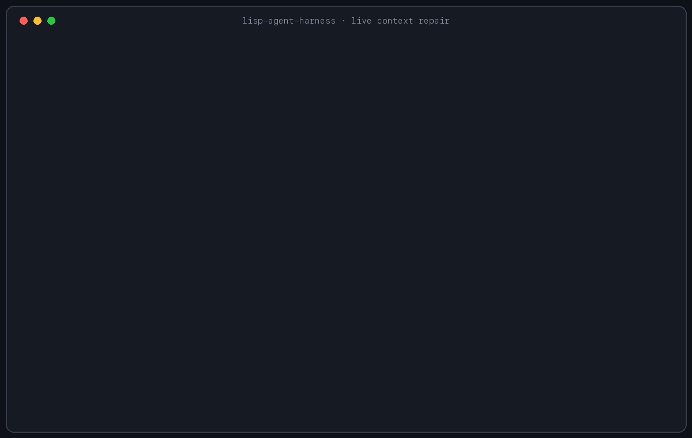

# Lisp Agent Harness

An executable spike for a tiny agent harness whose behavior is a live Guile
image. The permanent runtime owns authority, provider transport, tool execution,
and atomic generation switching; the user-owned Scheme image defines the agent.

This is intentionally not a production coding agent yet. The first question is
whether changing agent behavior *inside a running session* feels materially
better than editing and restarting a conventional extension.

## Try the live loop

Requirements: Guile 3.0, [ripgrep](https://github.com/BurntSushi/ripgrep), and
[Ollama](https://docs.ollama.com/). The checked-in image defaults to the locally
installed, tool-capable `qwen3.8:27b-mlx` model at Ollama's native
`http://127.0.0.1:11434/api/chat` endpoint.

```sh
make test
./bin/lisp-agent
```

At the prompt:

```text
live-agent> hello
thinking> ...reasoning streams here...
assistant> ...answer streams here...

live-agent> /eval (define agent-system-prompt "Reply in uppercase.")
generation 2 ...

live-agent> hello
...response using the patched prompt...

live-agent> /rollback
generation 1 ...

live-agent> hello
...response using the restored prompt...
```

Edit `agent/default.scm` and enter `/reload` to load the file as another atomic
generation. `/reload-clean` intentionally drops session patches.

The agent has the same constrained mechanism as the user. For example, ask:

```text
live-agent> Update your prompt so you remember my name is Paul.
```

It calls `live_eval` with Scheme such as `(set! agent-system-prompt ...)` and
first explains the binding, reason, and expected effect. The tool then reports
the before/after generation IDs and fingerprints; the agent explains that result
before continuing. It does not need to rewrite its source through a shell.
Failed patches leave the current generation intact, and `/rollback` undoes a
successful one.

Live patches are limited to 16 KiB and 64 active patches. Their top-level forms
may only be `define`, `define*`, `set!`, or `begin`, and definitions or
assignments must target `agent-*` or `extension-*` names. They still run in the
curated Scheme module and the complete candidate image must pass validation
before it activates. The provider only sees `live_eval` on turns where the user
expresses explicit change intent (for example “fix,” “update,” “change,” or
“configure”), which blocks unsolicited self-rewrites. This narrows accidental
mutation; it is not a resource or semantic sandbox.

## Persistent extension artifacts

A useful live change can become a named Scheme artifact without rewriting the
base agent image. Artifacts live in `extensions/*.scm`, are disabled when
created or exported, and load through the same validated generation boundary:

```text
/extensions
/extension-create terse (set! agent-system-prompt "Answer in one short paragraph.")
/extension-load terse
/extension-disable terse
/extension-export repaired-session
```

`/extension-enable` is an alias for `/extension-load`. Export collects the
active live patch stack, so it can be loaded again after restarting the
process. The agent can perform the same lifecycle through its `extension` tool:
“save your current live changes as an extension named `repaired-session`.”
Artifacts never auto-load and existing names are never overwritten.

## Memorable demo: repair bad context live

The context-selection demo starts with a deliberately stale selector, lets the
agent repair its own `agent-select-context` Scheme function, and retries without
restarting the process:

```sh
make phoenix
make demo-context
```

Follow the short conversation in `demo/context-selection/session.txt`, or run
it automatically with `make demo-context-scripted`. The first answer comes from
the 2024 runbook in generation 1; the user naturally challenges that source,
and the repaired selector uses the 2026 runbook in generation 2. `/traces` and
Phoenix show both selected paths and exactly which generation produced each
answer. See `demo/context-selection/README.md`.



## Ollama default

Start Ollama, confirm the model is installed, and run the harness:

```sh
ollama list
./bin/lisp-agent
```

The selected default advertises completion, tool calling, thinking, vision, and
a 262K context window in the local Ollama metadata. It was chosen over the
104 GB `qwen3.8-flash-next:125b-mlx` model to keep interactive iteration
practical. The live harness has been exercised end to end with this model making
a `read` tool call and incorporating the result.

Native Ollama output streams by default. `agent-thinking` may be `#t`, `#f`, or
the model-specific levels `'low`, `'medium`, and `'high`; `agent-stream?`
controls streaming. All are live:

```text
/eval (define agent-model "your-model-id")
/eval (define agent-thinking 'medium)
/eval (define agent-stream? #f)
```

For a remote OpenAI-compatible provider, also redefine `agent-base-url` and the
name of the environment variable holding its credential:

```text
/eval (define agent-provider 'openai)
/eval (define agent-base-url "https://your-provider.example/v1")
/eval (define agent-api-key-environment "OPENAI_API_KEY")
```

Set the environment variable before launching the process. The generic
OpenAI-compatible adapter is currently non-streaming. To exercise live
generations without any model, set `agent-model` to `"demo"`.

The model can call `read`, `rg`, `write`, `edit`, `shell`, `live_eval`, and
`extension`. File operations are canonicalized and restricted to the process
working directory. `rg` invokes ripgrep directly, `write` replaces a complete
file atomically, and `edit` requires an exact unique match unless `replace_all`
is explicit. Shell commands require a confirmation for every call; the live
image can tighten that policy to `deny`, but cannot set ambient `allow`.
`live_eval` can only use the curated Scheme surface and cannot introduce
process, filesystem, network, dynamic-loading, or ambient evaluation authority.

## Traces and Phoenix

Every completed turn writes OpenInference-shaped `AGENT`, `LLM`, and `TOOL`
spans to `.lisp-agent/traces.jsonl`. They include hierarchy, generation and turn
IDs, model name, bounded inputs/outputs/thinking, duration, status, and Ollama
token counts. This is separate from the append-only audit journal at
`.lisp-agent/events.scm-log`.

Enter `/traces` for a quick local summary. For a full trace UI, start the
official Phoenix container (requires Docker):

```sh
make phoenix
```

This starts Phoenix in the background, waits for its health check, exposes it at
`http://localhost:6006`, and stores its database in a persistent Docker volume.
Then launch the harness with OTLP export enabled:

```sh
make run-traced
```

Open `http://localhost:6006` and select the `lisp-agent-harness` project. The
small Python bridge is dependency-isolated by `uv` and sends OTLP/HTTP protobuf
to Phoenix asynchronously; tracing is still fully functional as local JSONL
when it is absent. `make run-traced` fails fast if local Phoenix is not healthy.
Set `LISP_AGENT_OTEL_ENDPOINT` or `PHOENIX_COLLECTOR_ENDPOINT` to export to a
different collector.

To inspect Phoenix logs or stop the container without deleting its trace volume:

```sh
make phoenix-logs
make phoenix-down
```

## Current boundary

The stable runtime provides:

- Fresh-module evaluation and validation
- Atomic activation and rollback
- An append-only S-expression event journal plus structured JSONL spans
- Native streaming Ollama transport, OpenAI-compatible fallback, and bounded
  tool output
- A curated live-language interface without process, filesystem, network,
  dynamic-loading, module-resolution, or `eval` functions
- Project-confined read, search, atomic write, and exact-edit capabilities
- Named, non-overwriting Scheme extension artifacts that can be loaded,
  disabled, or exported from active live patches
- Hard authority validation (`agent-shell-policy` may be `deny` or `ask`, never
  ambient `allow`)

The live image provides:

- Agent name, model selection, and system prompt
- Provider, base URL, API-key environment-variable name, streaming, and thinking
- Enabled tool names
- Maximum tool-call rounds
- Context selection, user-input transformation, and demo behavior
- Shell policy within the authority ceiling

Each request stays pinned to the generation that began it. New code activates
only between requests. Failed evaluations leave the active generation intact.

## Layout

```text
agent/default.scm             live user-owned image
src/live-agent/generation.scm isolated module generations
src/live-agent/runtime.scm    transitions, rollback, journal
src/live-agent/extensions.scm persistent artifact lifecycle
src/live-agent/provider.scm   native Ollama and Chat Completions adapters
src/live-agent/trace.scm      JSONL spans and optional OTLP bridge
src/live-agent/tools.scm      stable capability checks
src/live-agent/json.scm       dependency-free JSON codec
src/live-agent/main.scm       interactive shell
extensions/README.md          artifact contract
test/*.scm                    runtime, provider, JSON, extension, and tool tests
```

Journal and trace attribute values larger than 4 KiB are truncated. Tool output
is bounded at 64 KiB, writes at 256 KiB, and edited source files at 512 KiB;
larger artifacts should be externalized and referenced.

## Gaps versus Pi

This spike is testing a narrower idea than Pi. It now has one concrete advantage
to evaluate—transactional, generation-attributed live behavior—but it lacks most
of the product surface of a mature coding harness. See `docs/gaps-with-pi.md` for
the direct comparison and the gaps on both sides.

## License

[MIT](LICENSE) © 2026 Paul Thrasher.
